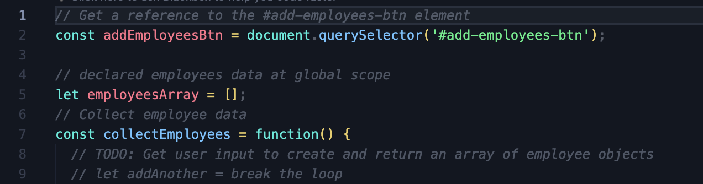
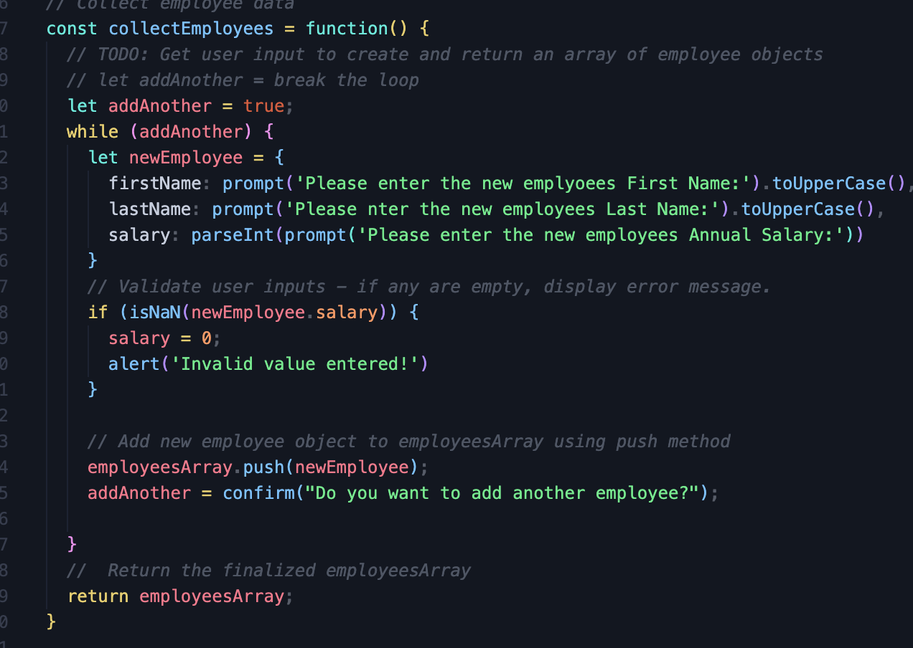
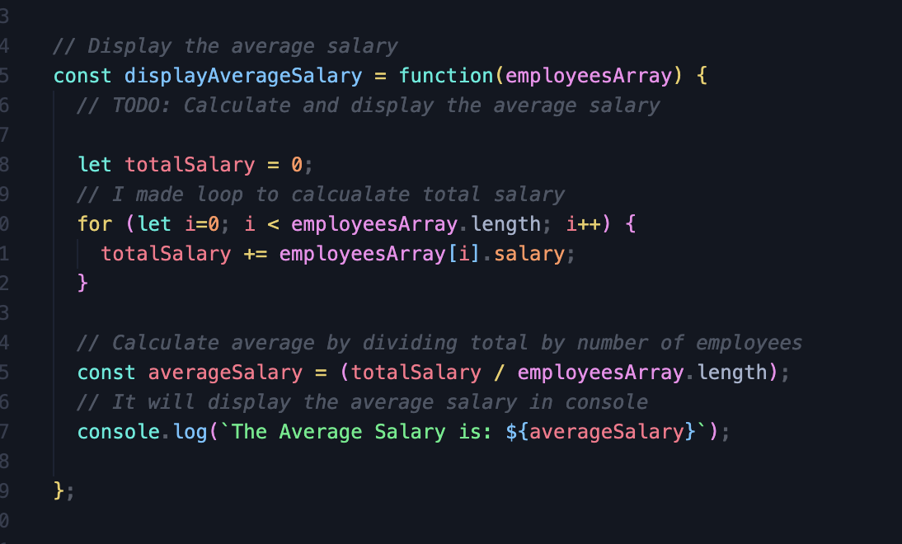
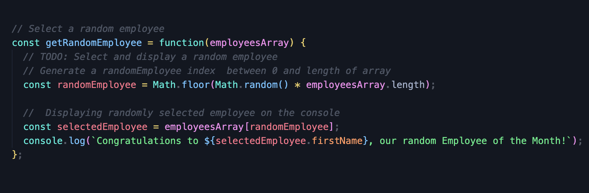

# employee-payroll-tracker

## What Is A Employee Payroll Tracker?
* A payroll tracker is a tool that helps small business owners and managers keep track of employee information, pay rates, and deductions. It can be used to calculate payroll costs, provide detailed earnings statements, and manage vacation and sick leave for each employee.

## What Was The Problem With Web Page?
* Problem was with the javascript codes.
* User input to create and return an array of employee objects codes were missing.
* There was no functionality for adding employees, removing employees or updating their information. 
* We were not able to calculate and display the average salary
* We need to select random employee and codes were missing.

## How Did I Solve These Issues?

* For the first issue I declared emplyoees data at global scope

* 

*  I made while loop for keep adding employee information until we stop adding. I made prompt for first, last name and salary. I used ```isNan``` for validate user input and added alert in case of typing invalid value.I pushed ```employeeArray``` to ```newEmployee``` and lastly I added confirm to stop adding employee information. 

* 

* Display the total salary and get average salary I added a ```let totalSalary = 0``` .  And every time we add an employee we increment this total salary with a ```for``` loop.

* 

* Get a random employee I basically used ```Math.floor(Math.random() * employeesArray.length)``` and I ```console.log``` the selected employee.

* 


## What Did I learned?
* It is important to declare variables in the right place so that they can be accessed by all functions within your code.
*  I learned how to push  elements into arrays using ```push()``` method in JavaScript.
* I learned how to use ```while``` and ```for``` loop.
* I learned how to use ```Math.floor(Math.random() * employeesArray.length)``` to select random index from the array.


## Links

* [Github Reposiory](https://github.com/veyselarslan12/employee-payroll-tracker)

* [Deployment Website Link](https://veyselarslan12.github.io/employee-payroll-tracker/)
